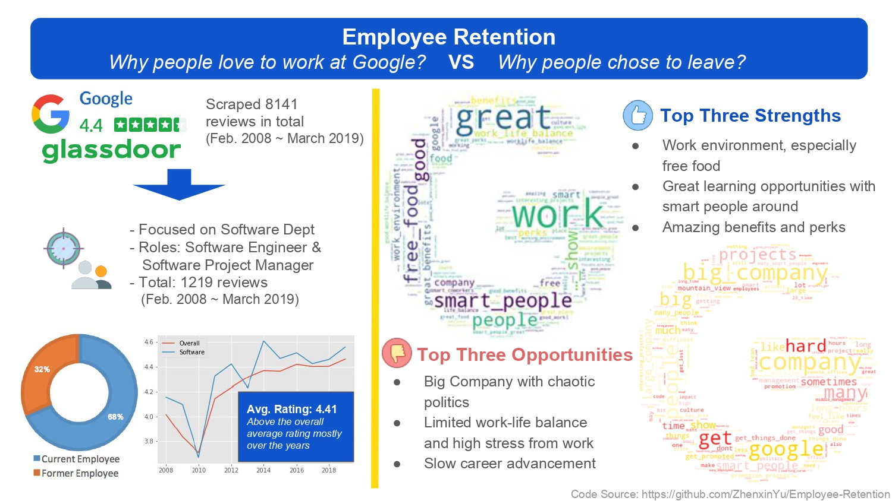
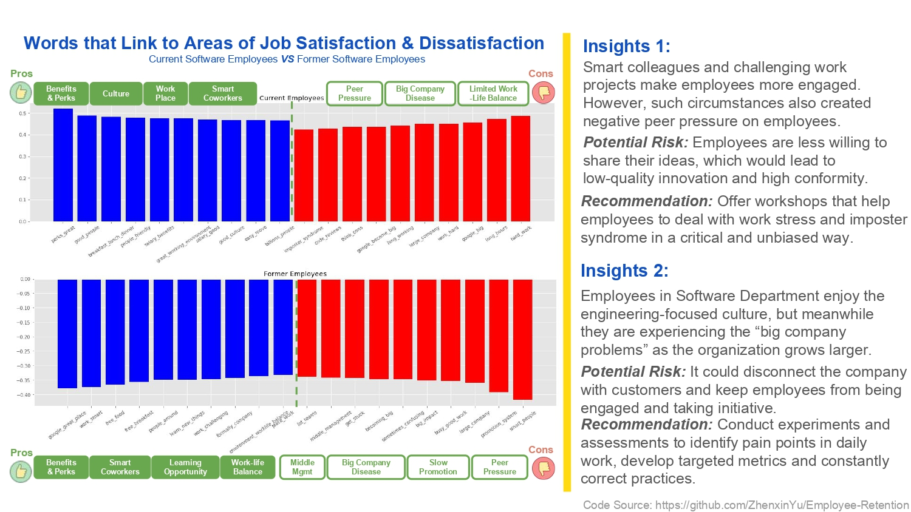

# Employee Retension

## 1. Objective
* Using python library (selenium and beautiful soup) to craw the review from different websites.
* Organize data collected and preprocess the data
* Perform analytic on the data collected and visualize the result
* Train model to predict feature and find vital pattern the is the most impactful.

## 2.Prerequisite
**Crawler**  
1. [Python3](https://www.python.org/downloads/)
2. [Pandas](https://pypi.org/project/pandas/)
3. [Selenium](https://selenium-python.readthedocs.io/)  
4. [BeautifulSoup (bs4)](https://www.crummy.com/software/BeautifulSoup/bs4/doc/)  
**Analysis**  
5. [numpy](http://www.numpy.org/)
6. [matplotlib](https://matplotlib.org/)
7. [nltk](https://www.nltk.org/)
8. [wordcloud](https://github.com/amueller/word_cloud)  
9. [Pillow](https://pillow.readthedocs.io/en/stable/)   
**Optional**   
10. [tqdm](https://github.com/tqdm/tqdm)

## 3. Data Source

### 3.1. Glassdoor
**Glassdoor** provides reviews of current and former employee for many company.   

### 3.2. Indeed
**Indeed** provides reviews of current and former employee for many company as well.  

## 4. Method

## 5. Result

